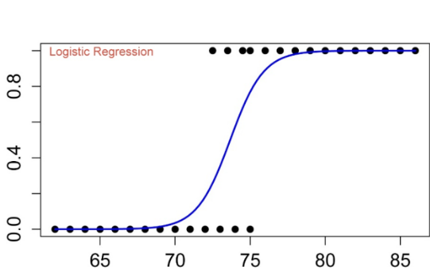
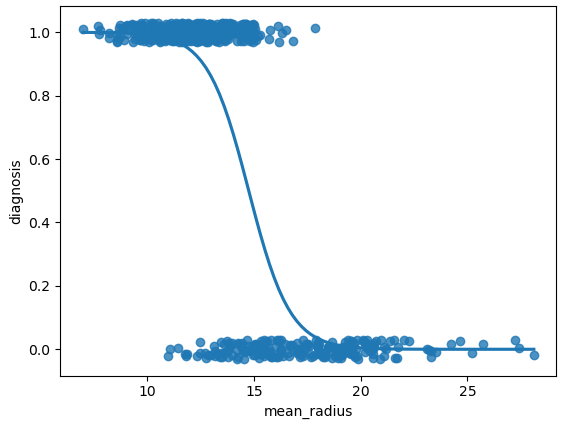
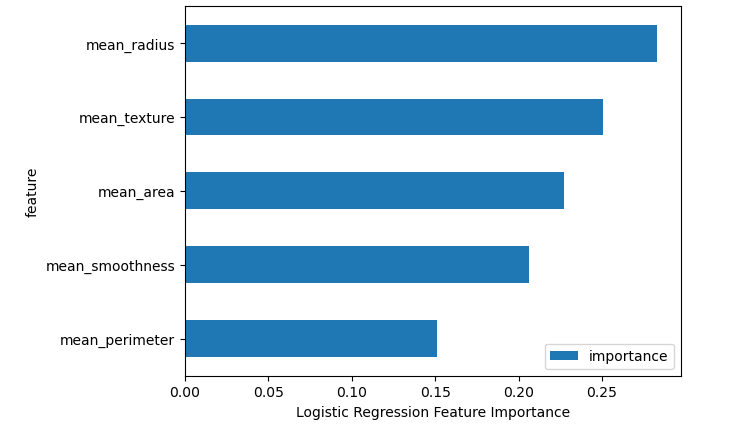
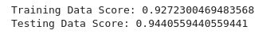

# Breast_Cancer_Prediction
Using Supervised Machine Learning - Logistic Regression Model to diagnose cancer.

[Image source]((https://miro.medium.com/proxy/0*u66Vb_z-Ij55HFc4))

## Background

### How Does Machine Learning Predict Cancer Outcomes?

One of the common machine learning (ML) tasks, which involves predicting a target variable in previously unseen data, is classification. The aim of classification is to predict a target variable (class) by building a classification model based on a training dataset, and then utilizing that model to predict the value of the class of test data. This type of data processing is called supervised learning since the data processing phase is guided toward the class variable while building the model. Some common applications for classification include medical diagnoses, among others.

## Project Overview

### Purpose

Worldwide, breast cancer is the most common type of cancer in women and the second highest in terms of mortality rates.Diagnosis of breast cancer is performed when an abnormal lump is found (from self-examination or x-ray) or a tiny speck of calcium is seen (on an x-ray). After a suspicious lump is found, the doctor will conduct a diagnosis to determine whether it is cancerous and, if so, whether it has spread to other parts of the body.

In this project, we will predict whether a patient has breast cancer or not.

This breast cancer dataset was obtained from UCI ML repository.

### Methodology

Algorithm and Implementation:

In this project, we will predict breast cancer based on fluid samples, taken from patients with solid breast masses. Based on certain features of the cell nucleus like “mean_radius”, “mean_texture”, “mean_perimeter”, “mean_area”, etc. we can predict whether the breast cancer is malignant or benign.

The data includes few categorical features, they need to be converted to numerical features so that any machine learning model can process them. We can use the “get_dummies” or “one_hot_encoder” function of sklearn library for it.

After some data processing, apply a machine learning algorithm. Apply a Logistic Regression Model. 

From sklearn.metrics, you can import classification_report, accuracy_score, precision_score, recall_score to check the performance metrics.

### Resources

#### Data:

* Breast_cancer_data.csv

#### Software and tools:

* Python, Jupyter Lab, Pandas, sqlalchemy, scikit-Learn, matplotlib, seaborn

## Machine Learning

### Preliminary data preprocessing

* Missing or null values were checked none found.

* Columns of no value dropped from data frame.

* Columns determined from feature exploration - not needed columns were dropped.

* Feature names were set as variable for later use.

* Data set split into train/test sets.

* Data scaled to normalize.

* Checked that all values were numerical using "X.describe()".

* Encoding was not used as all value-added data is numerical

### Data Processing

* Data (Breast_cancer_data.csv) trained through ML model, feature importance explored

* Features pruned

* Data (data_test) passed through ML model to predict target – ‘Position’

### Explain model choice:
* Supervised Machine Learning models were chosen due to the data having a label "Position".

### Logistic Regression

A type of regression model that predicts a probability. Logistic regression models have the following characteristics:

The label is categorical. The term logistic regression usually refers to binary logistic regression, that is, to a model that calculates probabilities for labels with two possible values. A less common variant, multinomial logistic regression, calculates probabilities for labels with more than two possible values.

The loss function during training is Log Loss. (Multiple Log Loss units can be placed in parallel for labels with more than two possible values.)
The model has a linear architecture, not a deep neural network. However, the remainder of this definition also applies to deep models that predict probabilities for categorical labels.

#### Limitations

* If the number of observations is lesser than the number of features, Logistic Regression should not be used, otherwise, it may lead to overfitting.
* The major limitation of Logistic Regression is the assumption of linearity between the dependent variable and the independent variables.

#### Benefits

* Logistic regression is easier to implement, interpret, and very efficient to train.
* It makes no assumptions about distributions of classes in feature space.
* It can easily extend to multiple classes (multinomial regression) and a natural probabilistic view of class predictions.
* It is very fast at classifying unknown records.

 Fig. 1.1 Logistic Regression plot. Credit srikarkatta.wordpress

## Results Overview:

### Logistic Regression

* Features were explored using coefficients, Recursive Feature Elimination (RFE) and Select from Model (SFM) methods for the Logistic Regression model. (Fig 1.3)

* All features used in model

* Model accuracy score: **0.94405** (Fig. 1.4)

* Accurately predictd whether a patient had breast cancer or not.

 Fig. 1.2 Logistic Regression model fit plot.

 

 Fig. 1.3 Logistic Regression feature importance.

 

 Fig. 1.4 Logistic Regression accuracy score.

 

## Summary:

* The accuracy for the logistic model was **94.41**%

* Plotted logistic regression model fit

* Plotted Feature Importance in Logistic Regression

* For our test we created "test_df" data frame (for predicttion)

* Saved predictions as diagnosis in "diagnosis_df"

* The models was able to accurate predict the samples that most probale would have cancer.

## References:

[Markdown](https://docs.github.com/en/get-started/writing-on-github/getting-started-with-writing-and-formatting-on-github/basic-writing-and-formatting-syntax)

[scikit-learn](https://scikit-learn.org/stable/)
 
[TensorFlow](https://www.tensorflow.org/)

[matplotlib](https://matplotlib.org/stable/api/_as_gen/matplotlib.pyplot.savefig.html)

[Google Machine Learning Glosary](https://developers.google.com/machine-learning/glossary#l)
